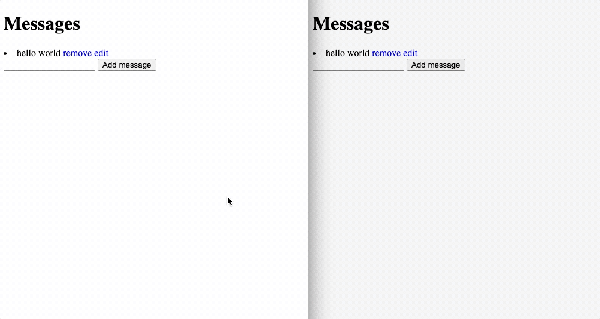

# go-hotwire

A POC/example on using Hotwire with Go, and a helper library to make server-sent
events a bit easier.

## Example

The example provided is a basic one-room chat that allows sending, receiving,
editing, and removing messages.

Simply run the example, and checkout `http://localhost:3000`.

```sh
go run examples/basic/main.go
```


